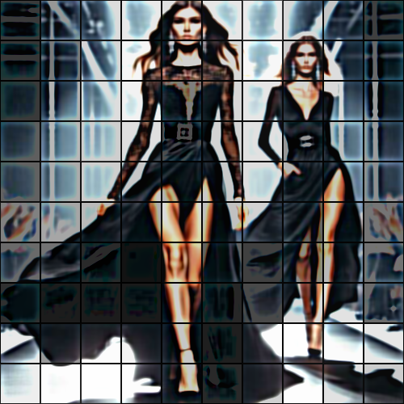

# appendtiles

Añade una textura de baldosas a la imagen.

Uso:

``` sh
applyeffect appendtiles imagen_original [imagen_destino]
```

Si no se indica un nombre para el fichero destino, aplicará el sufijo `_appendtiles.png`

Resultado:



