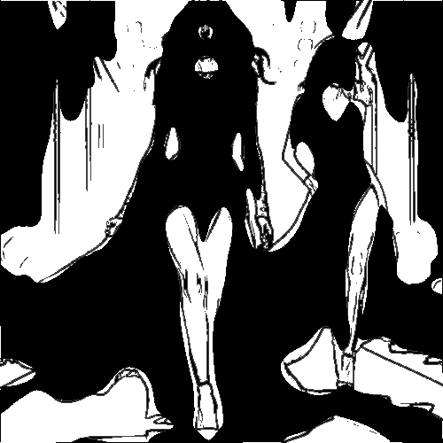

# areasbw

Convierte la imagen en manchas blancas y negras.

Uso:

``` sh
applyeffect areasbw imagen_original [imagen_destino]
```

Si no se indica un nombre para el fichero destino, aplicará el sufijo `_areasbw.png`

Resultado:



