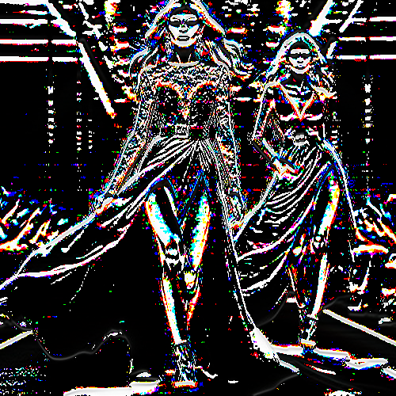

# blackembossed

Crea un relieve con puntos de color sobre fondo negro.

Uso:

``` sh
applyeffect blackembossed imagen_original [imagen_destino]
```

Si no se indica un nombre para el fichero destino, aplicará el sufijo `_blackembossed.png`

Resultado:



