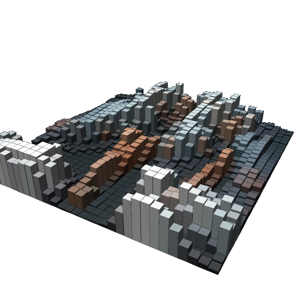

# blocks3d

Crea una imagen con bloques en 3D a partir de la imagen original.

Uso:

``` sh
applyeffect blocks3d imagen_original [imagen_destino]
```

Si no se indica un nombre para el fichero destino, aplicará el sufijo `_blocks3d.png`

Resultado:



