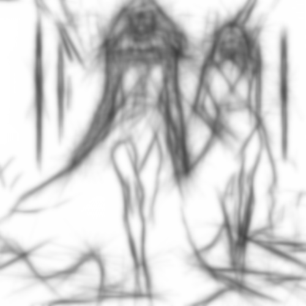

# blurrysketch

Dibuja los contornos de la imagen difuminándolos, como dibujados con carboncillo.

Uso:

``` sh
applyeffect blurrysketch imagen_original [imagen_destino]
```

Si no se indica un nombre para el fichero destino, aplicará el sufijo `_blurry_sketch.png`

Resultado:



