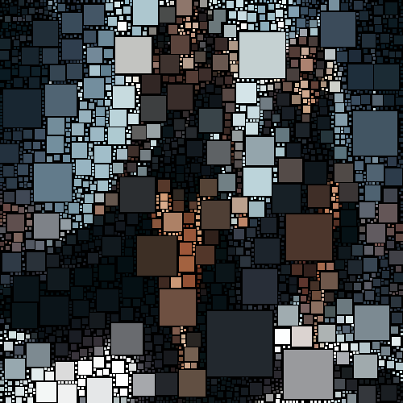

# boxfitting

Agrupa las zonas de color de la imagen en cuadrados de color uniforme.

Uso:

``` sh
applyeffect boxfitting imagen_original [imagen_destino]
```

Si no se indica un nombre para el fichero destino, aplicará el sufijo `_boxfitting.png`

Resultado:



