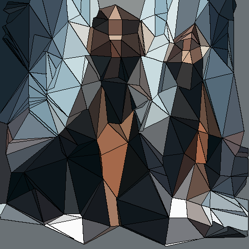

# brokenglass

Crea una textura sobre la imagen de cristal roto.

Uso:

``` sh
applyeffect brokenglass imagen_original [imagen_destino]
```

Si no se indica un nombre para el fichero destino, aplicará el sufijo `_brokenglass.png`

Resultado:



