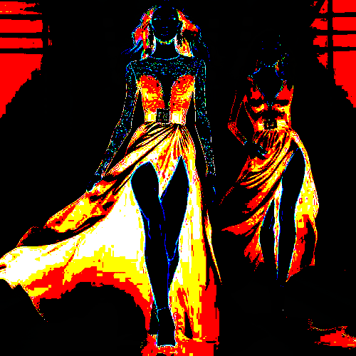

# calormap

Agrupa las zonas de color de la imagen dándole tonos negros o cálidos.

Uso:

``` sh
applyeffect calormap imagen_original [imagen_destino]
```

Si no se indica un nombre para el fichero destino, aplicará el sufijo `_calormap.png`

Resultado:



