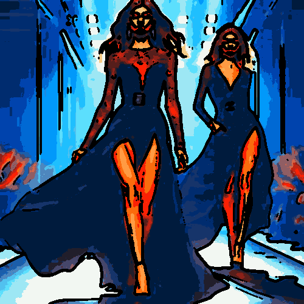

# cartoon

Genera un efecto cómic sobre la imagen.

Uso:

``` sh
applyeffect cartoon imagen_original [imagen_destino]
```

Si no se indica un nombre para el fichero destino, aplicará el sufijo `_cartoon.png`

Resultado:



