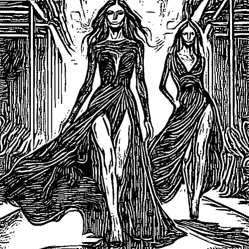

# charcoal

Crea un efecto de dibujo de la imagen a rotulador negro.

Uso:

``` sh
applyeffect charcoal imagen_original [imagen_destino]
```

Si no se indica un nombre para el fichero destino, aplicará el sufijo `_charcoal.png`

Resultado:



