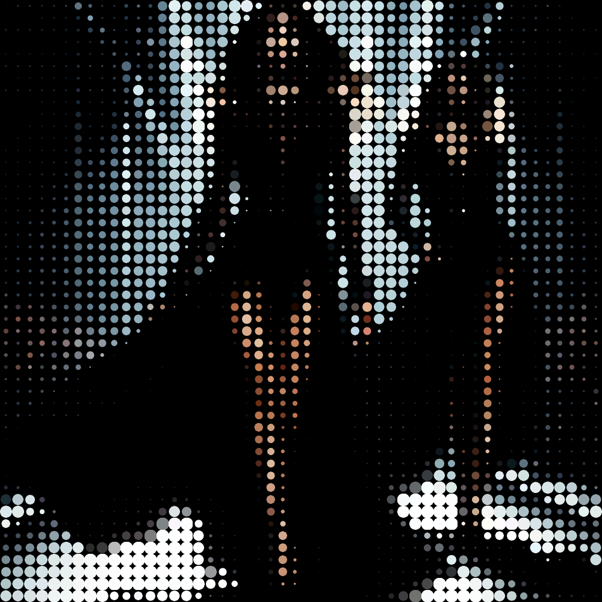

# circles

Agrupa los colores de la imagen en círculos de color uniforme.

Uso:

``` sh
applyeffect circles imagen_original [imagen_destino]
```

Si no se indica un nombre para el fichero destino, aplicará el sufijo `_circles.png`

Resultado:



