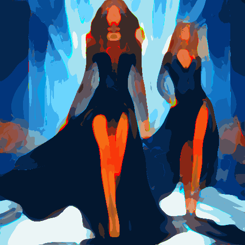

# colorsketch

Potencia los colores de la imagen uniéndolos en manchas de color anulando los matices.

Uso:

``` sh
applyeffect colorsketch imagen_original [imagen_destino]
```

Si no se indica un nombre para el fichero destino, aplicará el sufijo `_colorsketch.png`

Resultado:



