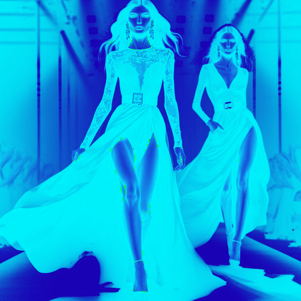

# contrastedblue

Cambiar los tonos claros de la imagen a azul oscuro y los tonos oscuros a azul celeste.

Uso:

``` sh
applyeffect contrastedblue imagen_original [imagen_destino]
```

Si no se indica un nombre para el fichero destino, aplicará el sufijo `_contrasted_blue.png`

Resultado:



