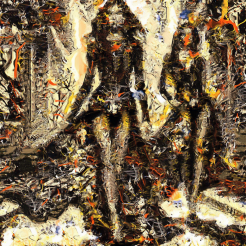

# convergence

Combina la imagen con el cuadro Convergence, de Jackson Pollock.

Uso:

``` sh
applyeffect convergence imagen_original [imagen_destino]
```

Si no se indica un nombre para el fichero destino, aplicará el sufijo `_convergence.png`

Resultado:



