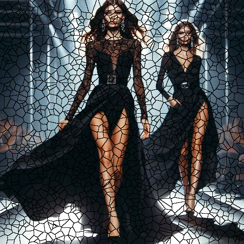

# cracks

Une los colores de la imagen en pequeñas regiones separadas por una línea negra, como un cristal golpeado.

Uso:

``` sh
applyeffect cracks imagen_original [imagen_destino]
```

Si no se indica un nombre para el fichero destino, aplicará el sufijo `_cracks.png`

Resultado:



