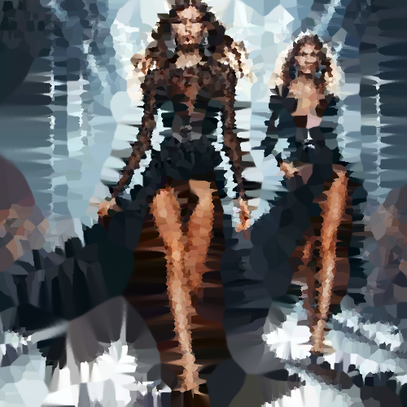

# crystal

Une los colores de la imagen en regiones de color distorsionando los contornos, como un cristal roto.

Uso:

``` sh
applyeffect crystal imagen_original [imagen_destino]
```

Si no se indica un nombre para el fichero destino, aplicará el sufijo `_crystal.png`

Resultado:



