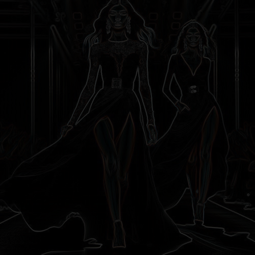

# darkandoutline

Dibuja el contorno de la imagen, con colores tenues sobre fondo negro.

Uso:

``` sh
applyeffect darkandoutline imagen_original [imagen_destino]
```

Si no se indica un nombre para el fichero destino, aplicará el sufijo `_dark_and_outline.png`

Resultado:



