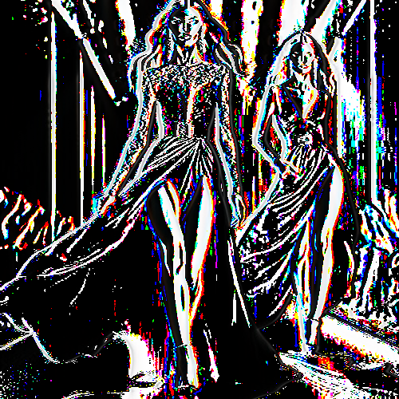

# deriche

Convierte las zonas homogéneas de color en blanco o negro con punteado de color en las zonas no homogéneas.

Uso:

``` sh
applyeffect deriche imagen_original [imagen_destino]
```

Si no se indica un nombre para el fichero destino, aplicará el sufijo `_deriche.png`

Resultado:



