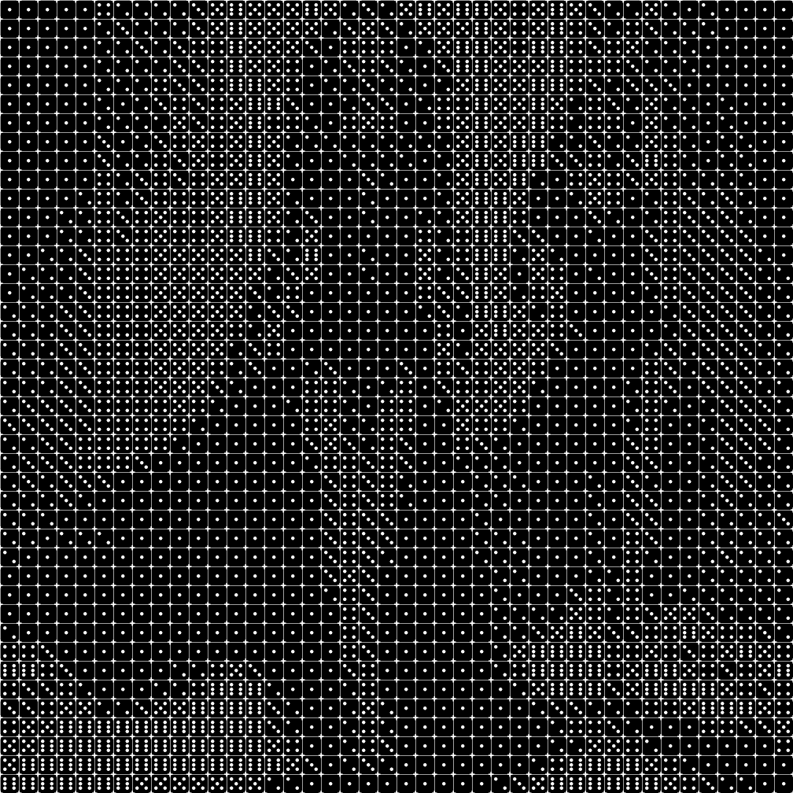

# dices

Convierte la imagen recibida a blanco y negro con textura punteada de dados.

Uso:

``` sh
applyeffect dices imagen_original [imagen_destino]
```

Si no se indica un nombre para el fichero destino, aplicará el sufijo `_dices.png`

Resultado:



