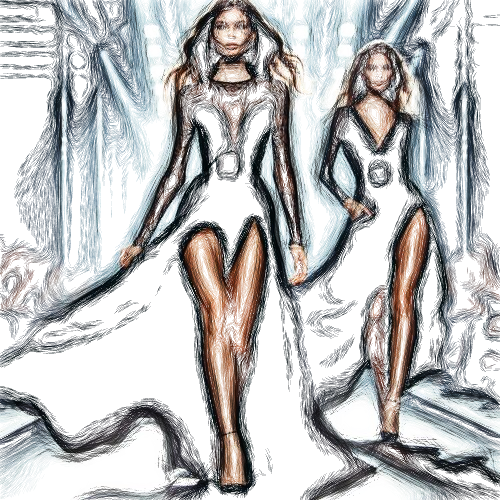

# doodlepen

Dibuja los contornos de la imagen garabateados, sobre fondo blanco.

Uso:

``` sh
applyeffect doodlepen imagen_original [imagen_destino]
```

Si no se indica un nombre para el fichero destino, aplicará el sufijo `_doodle_pen.png`

Resultado:



