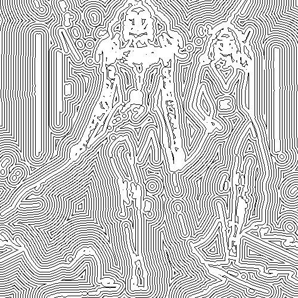

# edgeoffsets

Dibuja los contornos de la imagen con líneas negras redondeadas, rellenando el dibujo con líneas negras paralelas sobre fondo blanco.

Uso:

``` sh
applyeffect edgeoffsets imagen_original [imagen_destino]
```

Si no se indica un nombre para el fichero destino, aplicará el sufijo `_edge_offsets.png`

Resultado:



