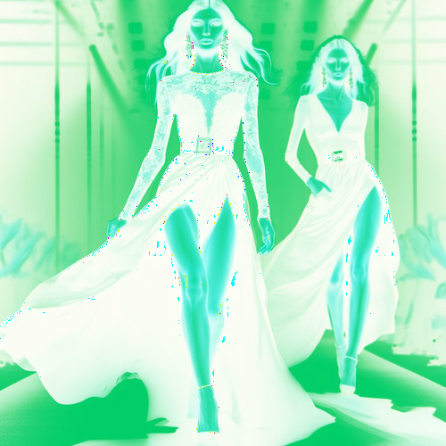

# electricalienandwhite

Cambia los tonos claros de la imagen a verde alien, convirtiendo los oscuros a blanco.

Uso:

``` sh
applyeffect electricalienandwhite imagen_original [imagen_destino]
```

Si no se indica un nombre para el fichero destino, aplicará el sufijo `_electric_alien_and_white.png`

Resultado:



