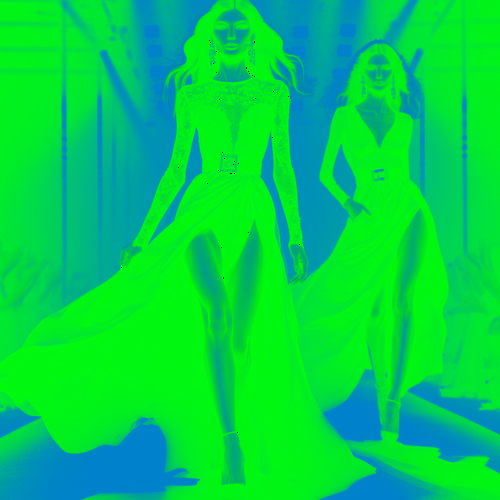

# electricgreenblue

Cambia los tonos claros de la imagen a azul, convirtiendo los oscuros a verde vivo.

Uso:

``` sh
applyeffect electricgreenblue imagen_original [imagen_destino]
```

Si no se indica un nombre para el fichero destino, aplicará el sufijo `_electric_green_blue.png`

Resultado:



