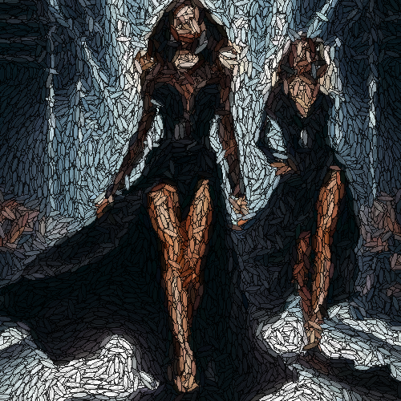

# ellipsionism

Modifica la textura de la imagen dibujando múltiples elipses.

Uso:

``` sh
applyeffect ellipsionism imagen_original [imagen_destino]
```

Si no se indica un nombre para el fichero destino, aplicará el sufijo `_ellipsionism.png`

Resultado:



