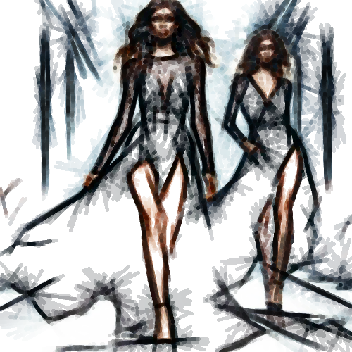

# feltpen

Dibuja los contornos de la imagen con trazos gruesos inacabados, como un esbozo a rotulador.

Uso:

``` sh
applyeffect feltpen imagen_original [imagen_destino]
```

Si no se indica un nombre para el fichero destino, aplicará el sufijo `_feltpen.png`

Resultado:



