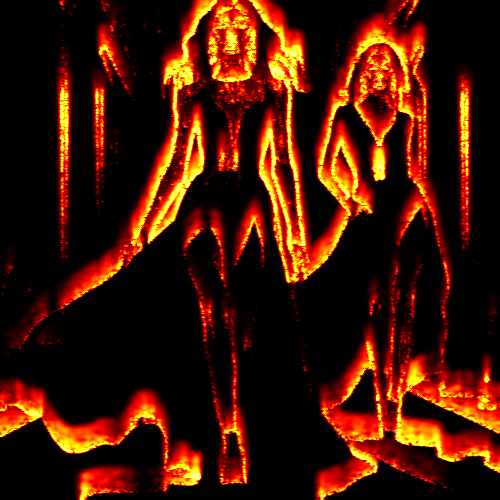

# fireedges

Dibuja los contornos de la imagen con líneas rojas y amarillas emulando llamas sobre fondo negro.

Uso:

``` sh
applyeffect fireedges imagen_original [imagen_destino]
```

Si no se indica un nombre para el fichero destino, aplicará el sufijo `_fire_edges.png`

Resultado:



