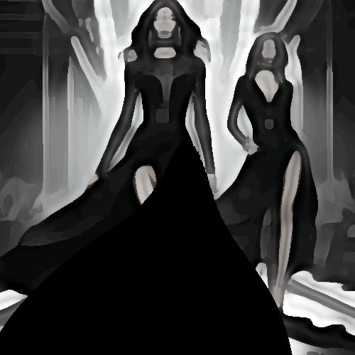

# flattenscolorsbw

Unifica y aplana las zonas de color de la imagen transformando a blanco y negro.

Uso:

``` sh
applyeffect flattenscolorsbw imagen_original [imagen_destino]
```

Si no se indica un nombre para el fichero destino, aplicará el sufijo `_flattenscolorsbw.png`

Resultado:



