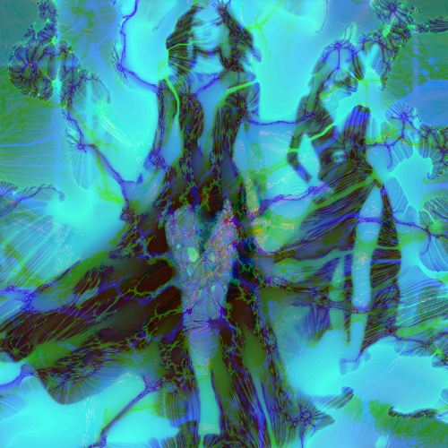

# fractalize

Aplica una textura fractal sobre la imagen.

Uso:

``` sh
applyeffect fractalize imagen_original [imagen_destino]
```

Si no se indica un nombre para el fichero destino, aplicará el sufijo `_fractalize.png`

Resultado:



