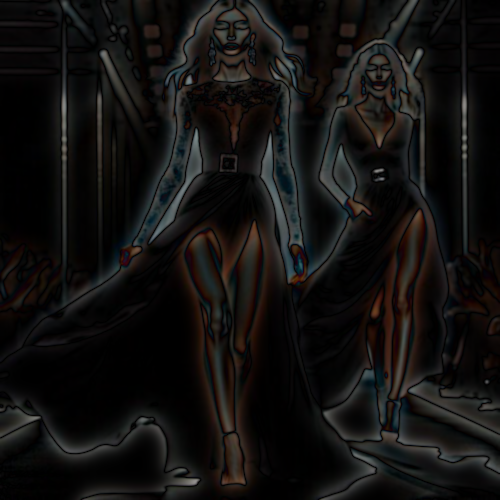

# gaussiandog

Convierte la imagen a negro, con los contornos definidos y difuminado alrededor de los contornos.

Uso:

``` sh
applyeffect gaussiandog imagen_original [imagen_destino]
```

Si no se indica un nombre para el fichero destino, aplicará el sufijo `_gaussiandog.png`

Resultado:



