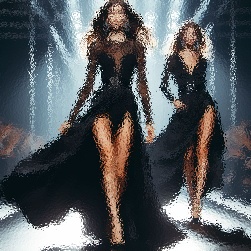

# glass

Dispersa ligeramente los píxeles de la imagen, generando una textura de cristal ondulado.

Uso:

``` sh
applyeffect glass imagen_original [imagen_destino]
```

Si no se indica un nombre para el fichero destino, aplicará el sufijo `_glass.png`

Resultado:



