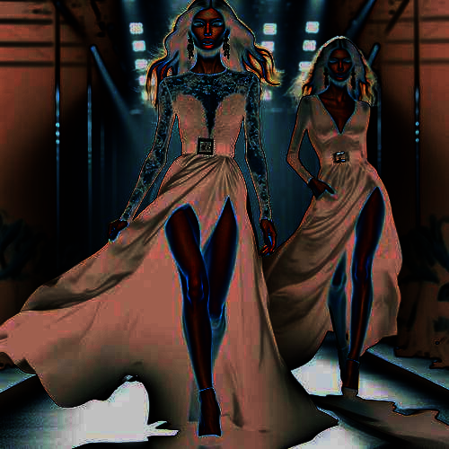

# glaze

Cambia los colores de la imagen, generando una textura de cristal en negativo.

Uso:

``` sh
applyeffect glaze imagen_original [imagen_destino]
```

Si no se indica un nombre para el fichero destino, aplicará el sufijo `_glaze.png`

Resultado:



