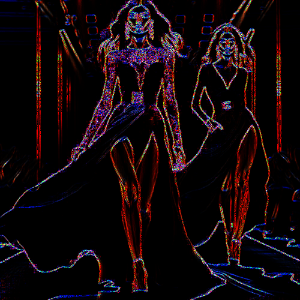

# glitteronblack

Dibuja los contornos de la imagen con punteado de colores sobre fondo negro.

Uso:

``` sh
applyeffect glitteronblack imagen_original [imagen_destino]
```

Si no se indica un nombre para el fichero destino, aplicará el sufijo `_glitter_on_black.png`

Resultado:



