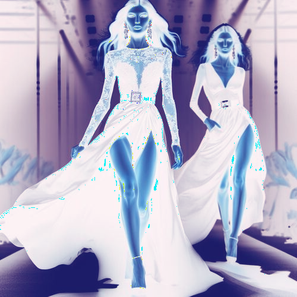

# grapeandwhite

Cambia los tonos claros de la imagen a color uva, convirtiendo los oscuros en blanco.

Uso:

``` sh
applyeffect grapeandwhite imagen_original [imagen_destino]
```

Si no se indica un nombre para el fichero destino, aplicará el sufijo `_grape_and_white.png`

Resultado:



