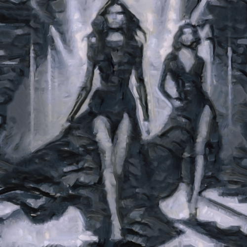

# graytree

Aplica una textura a la imagen del cuadro Gray tree de Mondrian.

Uso:

``` sh
applyeffect graytree imagen_original [imagen_destino]
```

Si no se indica un nombre para el fichero destino, aplicará el sufijo `_graytree.png`

Resultado:



