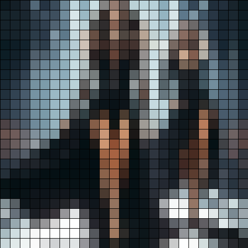

# grid

Aplica una textura de cuadros de color uniforme sobre la imagen.

Uso:

``` sh
applyeffect grid imagen_original [imagen_destino]
```

Para cambiar el tamaño de los cuadros, use el modificador `--intensity`. Valor por defecto: 20.

Si no se indica un nombre para el fichero destino, aplicará el sufijo `_grid.png`

Resultado:



