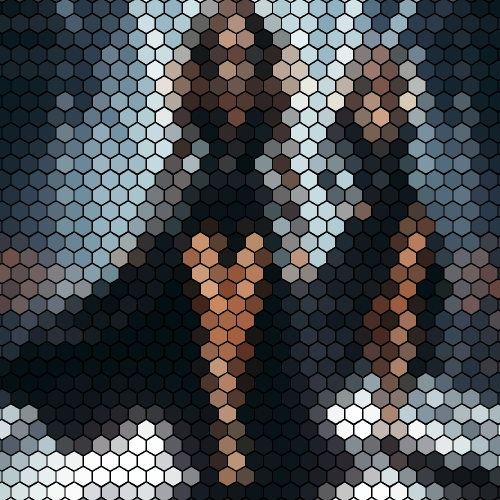

# gridhexagonal

Aplica una textura de hexágonos de color uniforme sobre la imagen.

Uso:

``` sh
applyeffect gridhexagonal imagen_original [imagen_destino]
```

Si no se indica un nombre para el fichero destino, aplicará el sufijo `_gridhexagonal.png`

Resultado:



