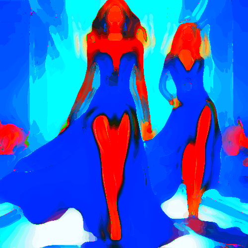

# handstrokes

Unifica las zonas de color de la imagen grandes manchas, como pintado a brochazos.

Uso:

``` sh
applyeffect handstrokes imagen_original [imagen_destino]
```

Si no se indica un nombre para el fichero destino, aplicará el sufijo `_handstrokes.png`

Resultado:



