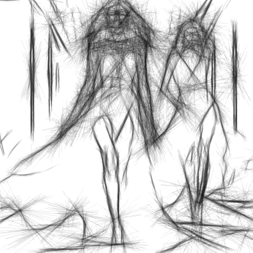

# hardsketchbw

Dibuja el contorno de la imagen en trazos alargados negros con fondo blanco, como un esbozo a mano.

Uso:

``` sh
applyeffect hardsketchbw imagen_original [imagen_destino]
```

Si no se indica un nombre para el fichero destino, aplicará el sufijo `_hardsketchbw.png`

Resultado:



