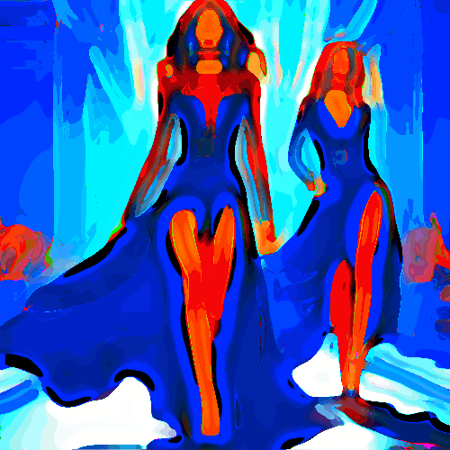

# hero

Unifica las zonas de color de la imagen grandes manchas con algunos contornos, como algunos cómics.

Uso:

``` sh
applyeffect hero imagen_original [imagen_destino]
```

Si no se indica un nombre para el fichero destino, aplicará el sufijo `_hero.png`

Resultado:



