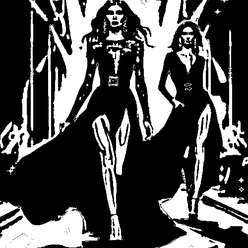

# inked

Convierte las zonas claras en blanco y las zonas oscuras en negro, sin grises.

Uso:

``` sh
applyeffect inked imagen_original [imagen_destino]
```

Si no se indica un nombre para el fichero destino, aplicará el sufijo `_inked.png`

Resultado:



