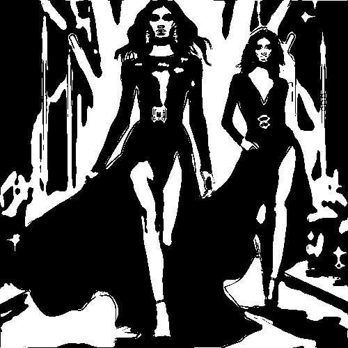

# inkedhardstroke

Convierte, sin escala de grises, las zonas claras en blanco y las zonas oscuras en negro en zonas redondeadas.

Uso:

``` sh
applyeffect inkedhardstroke imagen_original [imagen_destino]
```

Si no se indica un nombre para el fichero destino, aplicará el sufijo `_inkedhardstroke.png`

Resultado:



