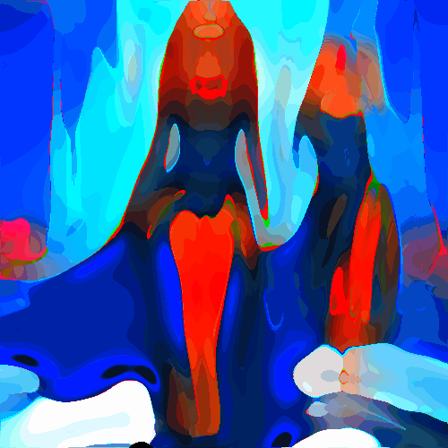

# intensestains

Unifica las zonas de color de la imagen en manchas de color intensificado.

Uso:

``` sh
applyeffect intensestains imagen_original [imagen_destino]
```

Si no se indica un nombre para el fichero destino, aplicará el sufijo `_intensestains.png`

Resultado:



