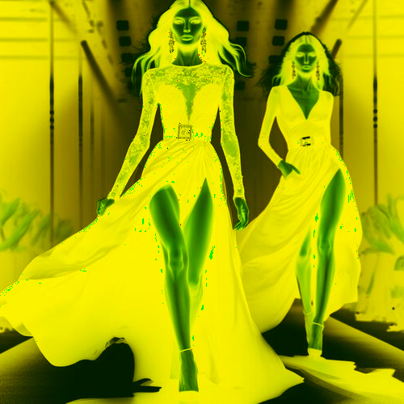

# intenseyellowandblack

Cambia el tono de las zonas claras de la imagen a negro y las zonas oscuras a amarillo intenso.

Uso:

``` sh
applyeffect intenseyellowandblack imagen_original [imagen_destino]
```

Si no se indica un nombre para el fichero destino, aplicará el sufijo `_intense_yellow_and_black.png`

Resultado:



