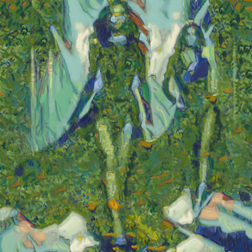

# irises

Combina la imagen con la textura del cuadro Los lirios de Vincent van Gogh.

Uso:

``` sh
applyeffect irises imagen_original [imagen_destino]
```

Si no se indica un nombre para el fichero destino, aplicará el sufijo `_irises.png`

Resultado:



