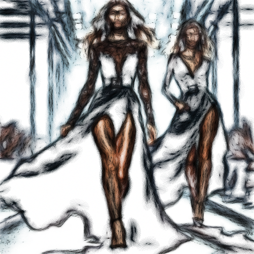

# judgment

Esboza a color los contornos de la imagen sobre fondo blanco, como en el dibujo de un juicio.

Uso:

``` sh
applyeffect judgment imagen_original [imagen_destino]
```

Si no se indica un nombre para el fichero destino, aplicará el sufijo `_judgment_draw.png`

Resultado:



