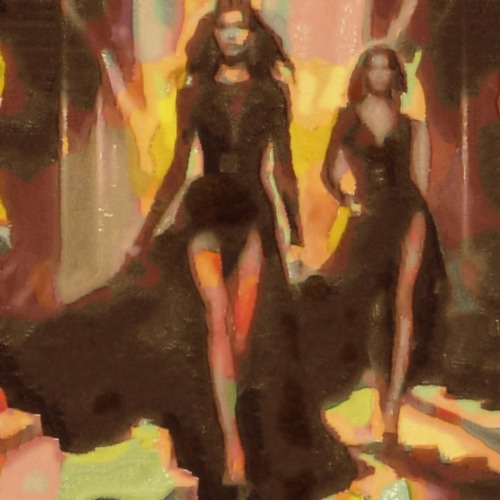

# kairouan

Combina la imagen con la textura del cuadro Al estilo de Kairouan, de Paul Klee.

Uso:

``` sh
applyeffect kairouan imagen_original [imagen_destino]
```

Si no se indica un nombre para el fichero destino, aplicará el sufijo `_inthestyleofkairouan.png`

Resultado:



