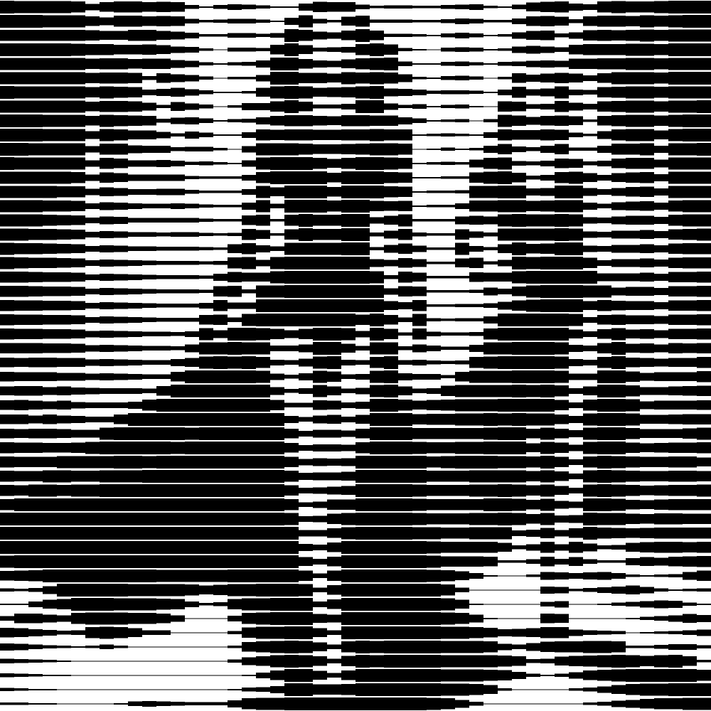

# kitt

Convierte la imagen a blanco y negro dibujada a líneas rectas horizontales de grosor variante.

Uso:

``` sh
applyeffect kitt imagen_original [imagen_destino]
```

Si no se indica un nombre para el fichero destino, aplicará el sufijo `_knight_rider.png`

Resultado:



