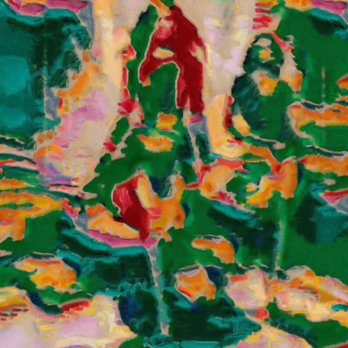

# landscape

Combina la imagen con la textura del cuadro Landscape near Antwerp, de Georges Braque.

Uso:

``` sh
applyeffect landscape imagen_original [imagen_destino]
```

Si no se indica un nombre para el fichero destino, aplicará el sufijo `_landscapenearantwerp.png`

Resultado:



