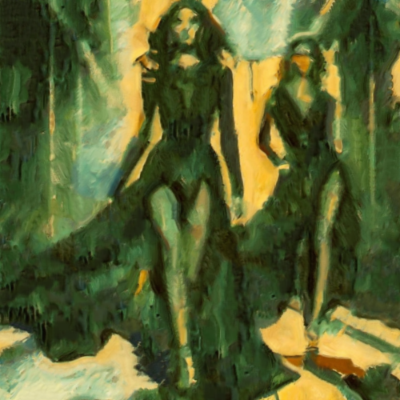

# leviaducalestaque

Combina la imagen con la textura del cuadro El Viaducto en L'Estaque (Le Viaduc à L'Estaque), de Georges Braque.

Uso:

``` sh
applyeffect leviaducalestaque imagen_original [imagen_destino]
```

Si no se indica un nombre para el fichero destino, aplicará el sufijo `_leviaducalestaque.png`

Resultado:



