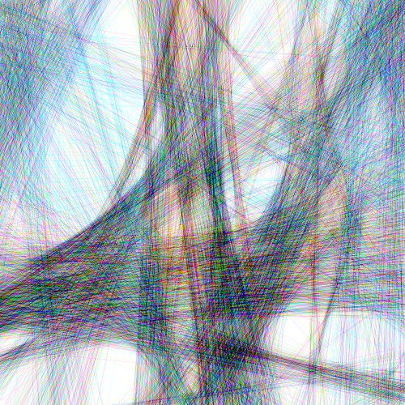

# linify

Proyecta los píxeles de color de la imagen sobre fondo blanco.

Uso:

``` sh
applyeffect linify imagen_original [imagen_destino]
```

Si no se indica un nombre para el fichero destino, aplicará el sufijo `_linify.png`

Para modificar la intensidad del efecto usar el modificador `--intensity`.

Valor por defecto: 25.

Resultado:



